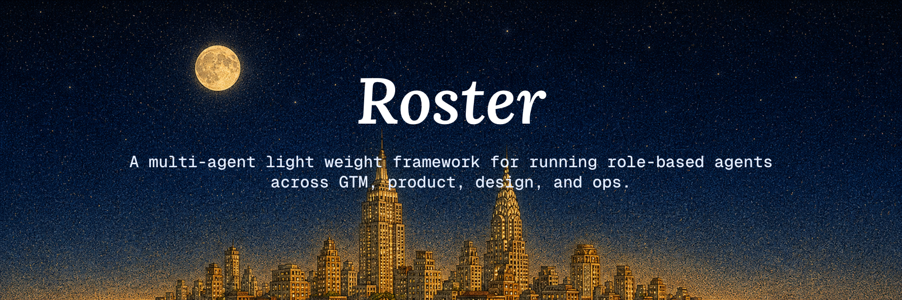

[](LICENSE)

# Roster

> A CLI that installs and scaffolds an opinionated multi-agent workspace for Claude Code today, with Codex CLI / Cursor / Gemini support landing in v0.2 — role-based agents for GTM, product, design, and ops, with a reinforcement loop that compounds learning.

## What is this?

`@firatcand/roster` is an npm CLI. You run it once and it does two things:

1. **`roster install`** — copies a curated set of skills and agent definitions into your AI coding tool's config dir. Today: `~/.claude/`. Coming in v0.2: `~/.codex/`, `~/.cursor/`, `~/.gemini/`.
2. **`roster init`** — scaffolds a structured agent-team workspace in any directory. v0.1 produces the minimal scaffold (`CLAUDE.md` + `projects/_demo/`); v0.2 adds the full tree (function dirs, role-based agents, maintenance agent, reinforcement agent).

The workspace it scaffolds separates **substrate** (strategic context: brand voice, ICPs, messaging) from **artifacts** (daily output: emails, posts, components), and runs work through named YAML **plans** that are deterministic, auditable, and schedule-friendly.

If you're a solo founder or ≤5-person team using Claude Code (or Codex / Cursor / Gemini) and you need outbound, content, design, and ops work done without losing context between sessions — this might fit.

## Quick start

```bash
# Install — no clone, no setup
npx @firatcand/roster install

# Scaffold a workspace in a fresh directory
mkdir my-team && cd my-team
npx @firatcand/roster init
```

**Heads-up on v0.1**: Phase 1 ships the CLI plumbing — `install` writes the `chief-of-staff` skill into `~/.claude/skills/`, `init` writes a minimal `CLAUDE.md` + `projects/_demo/`. The full agent-team workflow (running `/sdr`, `/chief-of-staff`, etc. against a populated workspace) lights up in v0.2 when `init` scaffolds the full tree (`conventions.md`, function dirs, scripts) and `install` ships the rest of the skills.

See [docs/roadmap.md](docs/roadmap.md) for what's shipped today vs in flight. [docs/HOWTO.md](docs/HOWTO.md) has the full step-by-step.

## Subcommands

| Command | What it does |
|---|---|
| `roster install` | Detect installed AI tools, prompt for selection, copy skills + agents into each tool's config dir. Idempotent. |
| `roster init [name]` | Scaffold the agent-team workspace into CWD. Substitutes `{{PROJECT_NAME}}`. |
| `roster doctor` | (Phase 2) Audit installed skills/agents for drift; report missing or stale components. |
| `roster --help` / `--version` | Usage + version from `package.json`. |

## Tool support

| Tool | Status |
|---|---|
| Claude Code | Phase 1 ✓ |
| Codex CLI | Phase 2 |
| Cursor | Phase 2 |
| Gemini | Phase 2 |

## What `init` scaffolds

The full target layout below shows the v0.2 scaffold. **v0.1 produces a minimal subset** — `CLAUDE.md` + `projects/_demo/` only. The rest lands as the Phase 2 scaffold work merges (see [docs/roadmap.md](docs/roadmap.md)).

```
my-team/                            ← v0.2 full layout
├── CLAUDE.md, conventions.md       ← workspace-level context
├── gtm/, product/, design/, ops/   ← functions (top-level domains)
│   ├── EXPERT.md                   ← function-level expert (substrate-shaping)
│   └── <agent-role>/               ← role-based agents (sdr, ux-designer, ...)
│       ├── agent.md                ← contract: purpose, inputs, plans, outputs
│       ├── plans/*.yaml            ← named workflows the agent can run
│       ├── subagents/*.md          ← reusable building blocks
│       └── projects/<project>/     ← per-project instance with config + logs
├── projects/<project>/             ← project-level shared substrate
│   └── CLAUDE.md, guidelines/      ← voice, ICPs, messaging, brand-book
├── chief-of-staff/                 ← cross-cutting maintenance agent
├── dreamer/                        ← cross-cutting reinforcement agent
├── scripts/                        ← backing scripts (create/archive/audit/rename)
└── .claude/commands/               ← workspace-level slash commands
```

The two big ideas behind the layout:

1. **Substrate vs artifacts**: experts shape substrate (project guidelines), agents produce artifacts (specific outputs). Don't conflate them.
2. **Plans**: each agent has named plans (YAML workflow recipes). Cron-friendly. Auditable. Reusable.

## Documentation

- [docs/HOWTO.md](docs/HOWTO.md) — recipes for common tasks (install, init, create project, run agent, audit, etc.)
- [docs/ARCHITECTURE.md](docs/ARCHITECTURE.md) — design rationale, the substrate-vs-artifacts model, lessons protocol, dreamer reinforcement loop
- [docs/API.md](docs/API.md) — every script, config schema, and convention
- [docs/roadmap.md](docs/roadmap.md) — what's shipped, what's next

## Opinions you can replace

The CLI ships a curated set of skills and agent definitions — these are starting points, not law.

- Function categories (`gtm/`, `product/`, `design/`, `ops/`) are defaults. Add your own with `/chief-of-staff create-function`.
- The example experts reflect one founder's judgment. Replace freely.
- The demo project (`projects/_demo/`) is safe to delete after init.

## What this is NOT

- Not a hosted SaaS — you run it locally against your own AI coding tool.
- Not a build/CI tool — for that, see [forge](https://github.com/firatcand/forge) (complementary, not bundled).
- Not a substitute for thinking — it's a structure for organizing your thinking.

## License

MIT. See [LICENSE](LICENSE).

## Contributing

See [CONTRIBUTING.md](CONTRIBUTING.md). Contributors working on the CLI itself should read [CLAUDE.md](CLAUDE.md) for build/test/layout conventions.

## Acknowledgments

Built on top of [Claude Code](https://claude.com/code) and the broader AI-coding-tool ecosystem.
